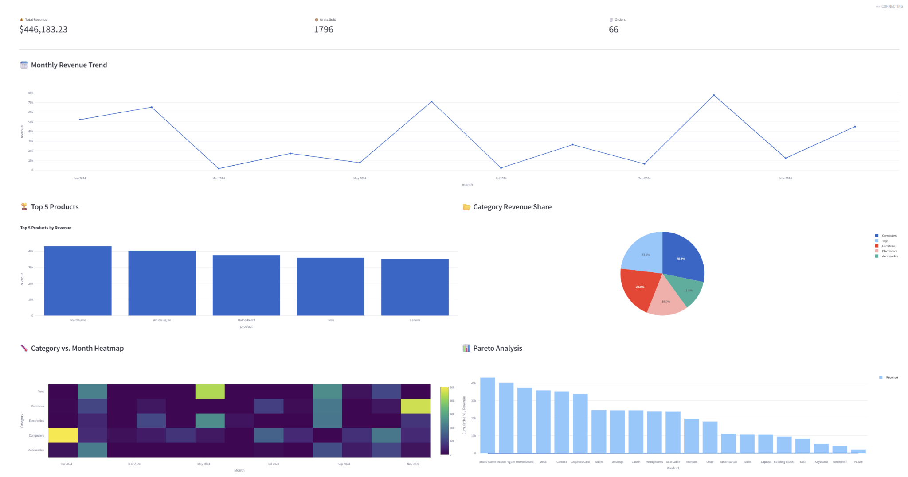
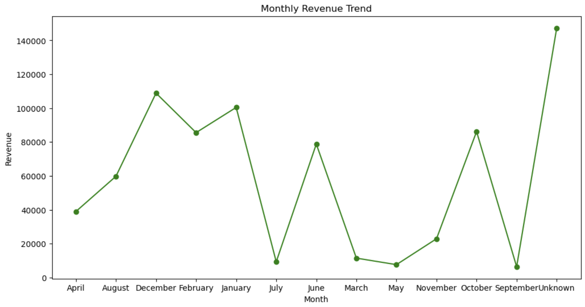
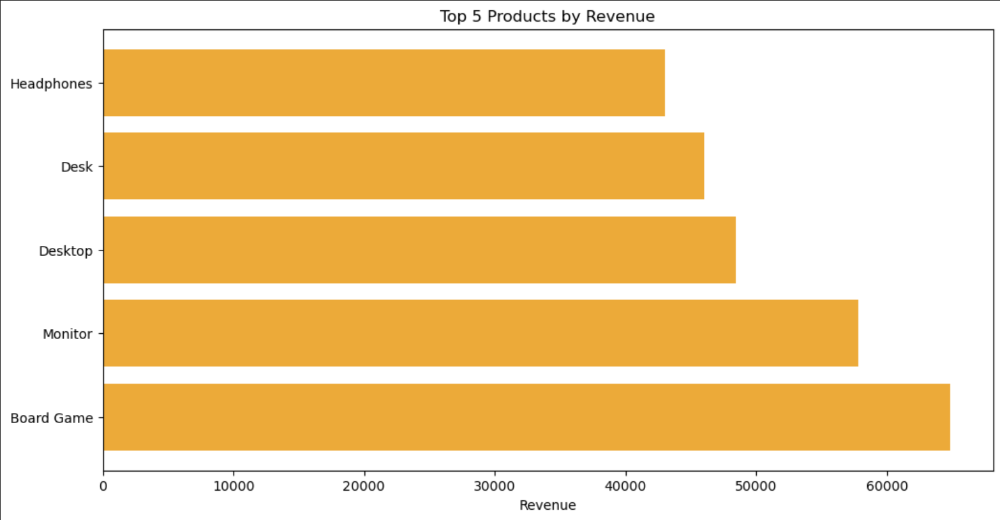
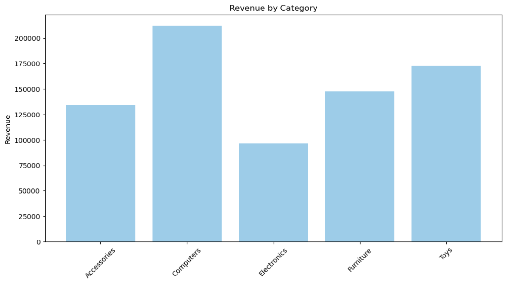

# Skyline Gadgets: Exploratory Data Analysis (EDA)

---

## Executive Summary

Skyline Gadgets is an online retailer specializing in a diverse range of electronics and accessories, including phones, computers, home electronics, and related categories. As the company scales its operations and transitions from spreadsheet-based tracking to data-driven decision making, this exploratory data analysis (EDA) project provides a foundational understanding of product performance, category-level trends, and revenue-driving behavior.

The goal of this analysis is to uncover actionable insights into what sells best, when it sells, and how much revenue is being generated across different segments. Using a cleaned sales dataset and Python-based tools (pandas, NumPy, matplotlib), the analysis explores both summary statistics and time-based trends to assist the business in smarter stocking, targeted promotions, and more effective resource allocation.

---

## Objectives

- Clean and prepare historical sales data by handling missing values and standardizing formats  
- Create a revenue metric to evaluate performance at both product and category levels  
- Identify top-performing products and categories by total revenue  
- Analyze monthly revenue trends to detect seasonal or cyclical sales patterns  
- Visualize key findings using clear, interpretable charts  
- Provide concrete business recommendations and highlight data quality concerns  

---

## Dashboard Summary: Skyline Sales Dashboard

[🔗 Click here to view the live interactive dashboard](https://skyline-interactive-dashboard-bxi5mxm9vqlmvxuserf9w.streamlit.app)

---

### 1. KPI Overview

| Metric         | Value        | Insight                                          |
|----------------|--------------|--------------------------------------------------|
| Total Revenue  | $446,183.23  | Strong performance across the cohort            |
| Units Sold     | 1,796        | High transaction volume                          |
| Orders         | 66           | ~27 items per order, indicating bundling        |

---

### 2. Monthly Revenue Trend

- Fluctuating pattern, with spikes in **Jan, Jun, Oct**  
- Dips in **March, May, Sept**  
- Action: Use trends to plan inventory and marketing in advance  

---

### 3. Top 5 Products

- Board Game leads in revenue — seasonal hero product  
- Diverse top 5 includes Toys, Furniture, and Computers  

---

### 4. Category Revenue Share

- Computers: 29.3% of total revenue  
- Toys: 23.3%, Furniture: 20.9%, Electronics: 15.5%, Accessories: 11.0%  

---

### 5. Category vs. Month Heatmap

- Toys strong in June and November  
- Furniture peaks in Jan, May, and Nov  
- Electronics inconsistent — audit needed  

---

### 6. Pareto Analysis

- Top 5–7 products generate over 50% of revenue  
- Focus on best performers; review long-tail SKUs  

---

## 📌 Strategic Recommendations

### 1. Product Category Strategy

**a. Computers (Highest Revenue Category)**
- **Action:** Maintain strong inventory levels for desktops, monitors, and related accessories.
- **Reasoning:** This category drives the most revenue and is backed by multiple top-selling products.
- **Next Steps:**
  - Expand product variety (e.g., budget, premium tiers).
  - Consider upselling and cross-selling with accessories.
  - Monitor return rates and satisfaction to manage quality.

**b. Toys (Top 3 Revenue Category)**
- **Action:** Treat as a seasonal growth driver.
- **Reasoning:** Likely gains during Q4 and summer seasons.
- **Next Steps:**
  - Promote popular SKUs during holidays.
  - Run volume-driven discounts.
  - Verify margins and pricing efficiency.

**c. Electronics (Lowest Revenue Category)**
- **Action:** Audit for performance issues.
- **Reasoning:** Underperformance despite potential demand.
- **Next Steps:**
  - Review SKU-level metrics.
  - Investigate marketing visibility.
  - Reevaluate pricing or discontinue poor sellers.

---

### 2. Product-Level Strategy

**a. Board Game (Top Product)**
- **Action:** Use in bundles and campaigns.
- **Reasoning:** Drives highest revenue; popular item.
- **Next Steps:**
  - Bundle with other Toys.
  - Feature prominently in marketing.
  - Track inventory and restock trends.

**b. Monitor, Desktop, Desk, Headphones**
- **Action:** Build themed bundles (e.g., Work-from-Home Kits).
- **Reasoning:** Popular across Computers and Accessories.
- **Next Steps:**
  - Launch limited-time offers.
  - A/B test bundled vs standalone performance.

---

### 3. Monthly Trends & Seasonality

**a. December, January, June (High Revenue Months)**
- **Action:** Prep inventory and marketing early.
- **Reasoning:** Strong historical demand.
- **Next Steps:**
  - Run pre-campaign ads 4–6 weeks in advance.
  - Offer early-bird specials.

**b. May, March, September (Low Revenue Months)**
- **Action:** Activate promotions during lulls.
- **Reasoning:** Prevent missed revenue opportunities.
- **Next Steps:**
  - Run flash sales and loyalty bonuses.
  - Collaborate with influencers for campaigns.

**c. "Unknown" Month Values**
- **Action:** Clean date formatting in data.
- **Reasoning:** Data quality issues distort trends.
- **Next Steps:**
  - Standardize date columns using pandas or Excel.
  - Recalculate monthly insights.

---

### 4. Operational & Reporting Enhancements

**a. Clean Metric Tracking**
- Automate exports for monthly and category-level revenue.
- Store reports in shared locations (e.g., GitHub, Google Drive).
- Use version control for comparisons and audits.

**b. Dashboarding Investment**
- Transition to live dashboards (e.g., Streamlit, Tableau).
- Benefits:
  - Real-time metrics
  - Enhanced visibility for all teams
- Include:
  - Filters for product, category, and date
  - KPI highlights (e.g., revenue, unit sales)

---

### 5. Data Quality and Governance

**a. Validation at Entry**
- Ensure future files follow consistent formatting:
  - `YYYY-MM-DD` for dates
  - No missing prices or quantities
  - Clean and unique product/category names

**b. Schema & Documentation**
- Create a data dictionary including:
  - Accepted values and formats
  - Required vs optional fields
- Use Excel validation rules or backend systems to enforce integrity.

---

## ✅ Summary Table

| Area | Recommendation |
|------|----------------|
| Top Category (Computers) | Maintain stock, promote bundles |
| Underperforming Category (Electronics) | Audit SKUs, assess customer interest |
| Top Product (Board Game) | Use in promo bundles, monitor inventory |
| Monthly Trends | Promote in May, March, September; prep for peaks |
| Data Quality | Clean unknown dates, enforce format rules |
| Reporting | Automate summaries, explore live dashboards |
